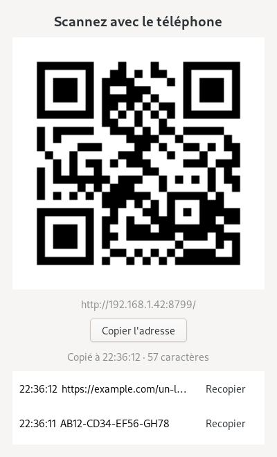

# QR-Clip

**Envoyer le presse-papier du téléphone vers le PC, en scannant un QR code.**

Le PC affiche un QR code, le téléphone le scanne, une page s'ouvre : on colle,
on appuie sur *Envoyer*, et le texte est dans le presse-papier du PC. Aucun
compte, aucun cloud, rien à installer sur le téléphone. Rien ne sort du Wi-Fi.

*[English version](README.md)*

<p align="center">
  
</p>

## Pourquoi

Faire passer une URL longue, un code à usage unique ou un bout de texte du
téléphone au PC, c'est en général s'auto-envoyer un mail, ou confier son
presse-papier au serveur d'un service de synchronisation. QR-Clip est
l'alternative locale en 30 secondes : on lance, on scanne, on colle.

## Points notables

- **Aucune dépendance.** Bibliothèque standard de Python, plus GTK 4 /
  PyGObject pour le presse-papier — déjà présent sur un bureau GNOME. Pas de
  `pip install`.
- **L'encodeur QR est écrit à la main** ([`qrmini.py`](qrmini.py), ~330 lignes) :
  mode octet, versions 1 à 10, Reed–Solomon sur GF(256), les huit masques avec
  score de pénalité, plus un écrivain PNG et un rendu ANSI pour le terminal.
  Avec de [vrais tests](test_qrmini.py).
- **Ça marche vraiment sous Wayland**, ce qui est la partie difficile : voir
  [plus bas](#le-problème-du-presse-papier-sous-wayland).
- **Réseau local uniquement, protégé par un jeton** régénéré à chaque lancement.
- **Mode sans fenêtre** (`--no-gui`) : le QR code s'affiche dans le terminal.

## Prérequis

- Python 3.7+ (testé en 3.11)
- PyGObject / GTK 4 (`python3-gi`, `gir1.2-gtk-4.0`) pour écrire dans le presse-papier
- Téléphone et PC sur le même Wi-Fi

Testé sur Debian 12 / GNOME 43 / Wayland.

## Démarrage rapide

```bash
git clone https://github.com/Knowdg-Team/QR-Clip.git
cd QR-Clip
./qrclip.py
```

Une fenêtre s'ouvre avec le QR code (il est aussi affiché dans le terminal).
On le scanne avec l'appareil photo du téléphone, on colle dans la page, on
appuie sur **Envoyer**. `Ctrl+C` pour arrêter.

### Options

| Option | Effet |
| --- | --- |
| `--port 8765` | Port d'écoute |
| `--no-gui` | Pas de fenêtre : QR code dans le terminal uniquement |
| `--discret` | N'affiche jamais le contenu reçu (mots de passe, jetons…) |
| `--no-token` | URL sans jeton, donc stable et mémorisable (moins sûr) |
| `--host 192.168.1.42` | Force l'adresse annoncée dans le QR |
| `--backend x11\|wayland` | Force le backend GTK |

### Lanceur de bureau (optionnel)

```bash
sed "s|@QRCLIP_PATH@|$PWD|" qrclip.desktop.in > ~/.local/share/applications/qrclip.desktop
```

## Comment ça marche

```
  téléphone                        PC
  ┌───────────┐   POST HTTP   ┌──────────────────┐
  │ page web  │ ────────────► │ http.server      │  (thread du serveur)
  │ (collage) │   + jeton     │        │         │
  └───────────┘               │        ▼         │
                              │  GLib.idle_add   │  (retour au thread GTK)
                              │        │         │
                              │        ▼         │
                              │  Gdk.Clipboard   │ ──► sélection X11 (XWayland)
                              └──────────────────┘         │
                                                           ▼
                                                   mutter fait le pont
                                                   vers les applis Wayland
```

- [`qrclip.py`](qrclip.py) — serveur HTTP, page mobile, fenêtre GTK 4.
- [`qrmini.py`](qrmini.py) — encodeur QR, écrivain PNG, rendu ANSI.

### Le problème du presse-papier sous Wayland

C'est la partie à lire si vous écrivez quelque chose de similaire.

Sous Wayland, `wl_data_device.set_selection` exige un *serial* provenant d'un
événement d'entrée récent : **seul le client qui a le focus clavier peut
prendre la sélection**. Un service en arrière-plan n'a jamais le focus, donc
`Gdk.Clipboard.set()` retourne **sans erreur et ne fait rien**. Aucune
exception, aucun avertissement : le seul moyen de s'en apercevoir est de
relire le presse-papier depuis un autre processus.

La solution est de passer par XWayland, où la propriété d'une sélection ne
dépend pas du focus ; mutter fait ensuite le pont vers les clients Wayland.
C'est exactement pour ça que `xclip` fonctionne encore sous GNOME.

```python
import os
if os.environ.get('DISPLAY'):
    os.environ['GDK_BACKEND'] = 'x11'   # AVANT d'importer gi
import gi
```

Deux pièges :

1. **`os.environ.setdefault` ne suffit pas.** La session GNOME exporte déjà
   `GDK_BACKEND=wayland` : il faut écraser la variable. Vérifier avec
   `type(Gdk.Display.get_default()).__name__`, qui doit afficher `GdkX11Display`.
2. **GDK n'est pas thread-safe.** Appelé depuis un thread du serveur HTTP,
   `clipboard.set()` échoue de la même façon silencieuse. Il faut passer par
   `GLib.idle_add`.

Conséquence : **QR-Clip doit rester lancé** tant qu'on veut coller le contenu,
puisque le processus qui possède la sélection est celui qui sert la donnée.
GNOME conserve en général le dernier contenu après la fermeture, mais le
protocole ne le garantit pas.

## Sécurité

- Le serveur écoute sur le réseau local en HTTP simple : à utiliser sur un
  Wi-Fi de confiance, pas sur un réseau public.
- L'URL contient un jeton aléatoire régénéré à chaque lancement ; sans lui, la
  page et l'envoi renvoient 403. Il empêche un voisin curieux d'écrire dans le
  presse-papier, il ne protège pas d'une écoute du réseau.
- Le contenu reçu est affiché en aperçu dans le terminal et la fenêtre :
  utiliser `--discret` pour envoyer des secrets.
- Envoi limité à 1 Mio.

## Limites

- Texte uniquement, du téléphone vers le PC.
- Le téléphone ne peut pas se pré-remplir depuis son propre presse-papier :
  `navigator.clipboard.readText()` exige un contexte sécurisé, et on est en
  HTTP sur une IP locale. Le collage reste manuel.
- Versions QR 1 à 10 (largement suffisant pour une URL courte).

## Dépannage

- **Le téléphone n'ouvre pas la page** : vérifier qu'il est sur le même Wi-Fi
  (ni 4G, ni VPN) et qu'aucun pare-feu ne bloque le port. Sur un réseau avec
  « isolation des clients », rien ne passera.
- **Mauvaise adresse dans le QR** (plusieurs interfaces) : `--host <ip>`.
- **« Address already in use »** : `--port 8766`.
- **Rien ne se colle** : vérifier la ligne `[qr-clip] presse-papier : …` au
  démarrage, et que QR-Clip tourne toujours au moment du collage.

## Tests

```bash
python3 test_qrmini.py
```

Vérifie l'encodeur QR contre un vecteur Reed–Solomon de référence, contrôle que
le polynôme des codewords est divisible par le générateur sur 220 tirages, et
fait 20 allers-retours encodage → décodage avec un décodeur écrit
indépendamment.

## Licence

MIT — voir [LICENSE](LICENSE).
